# 🐾 Meowseum

**Meowseum** is a cat-lover's mobile companion app built with React Native and Expo.  
Discover cat breeds, save your favorites, shop curated cat products, and enjoy a complete checkout experience — all in a clean, modern UI with support for light and dark modes.

---

## ✨ Features

- 🐱 Browse and explore popular cat breeds with images and descriptions  
- 💾 Save your favorite cats to a personal collection  
- 🛍️ Shop curated cat products (food, toys, accessories)  
- 🧾 Add products to cart with quantity control  
- 🚚 Full checkout flow: shipping address, payment methods, order confirmation  
- 💳 Payment options: UPI (PhonePe, GPay), NetBanking, Credit/Debit Card, Cash on Delivery  
- 🌗 Dark mode toggle  
- 👤 Login / Signup with email and social (Gmail, Facebook)  

---

## 🛠 Tech Stack

| Category         | Tools/Frameworks              |
|------------------|-------------------------------|
| **Framework**    | React Native + Expo           |
| **Navigation**   | React Navigation              |
| **UI & Styling** | Custom Theming + Icons/Assets|
| **Animation**    | Lottie (e.g., signup animation) |
| **State Mgmt.**  | React state/hooks             |
| **Payments UI**  | Custom forms & image assets   |

---

## 📱 Screenshots

### 🔹 Authentication Flow
<p align="center">
  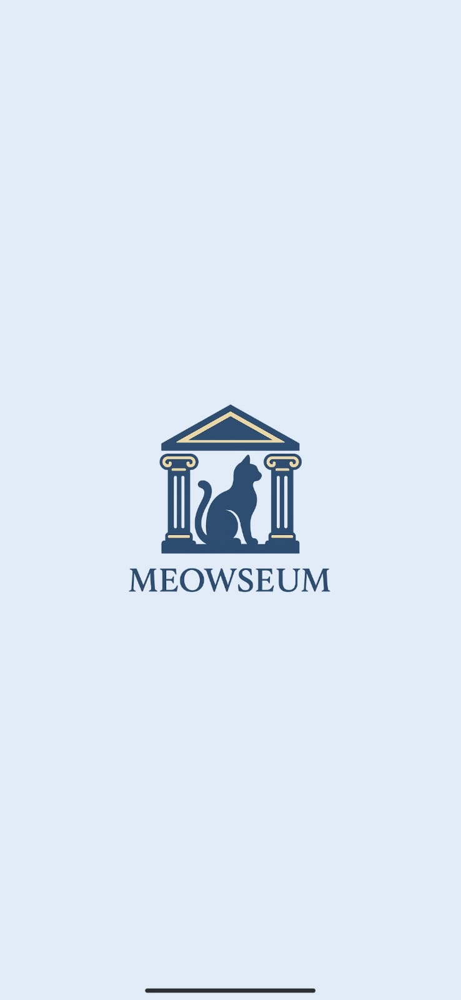
  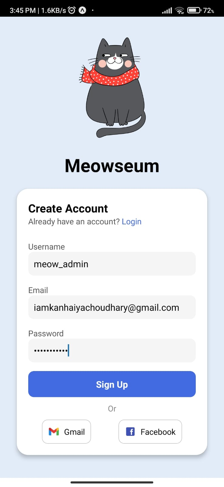
  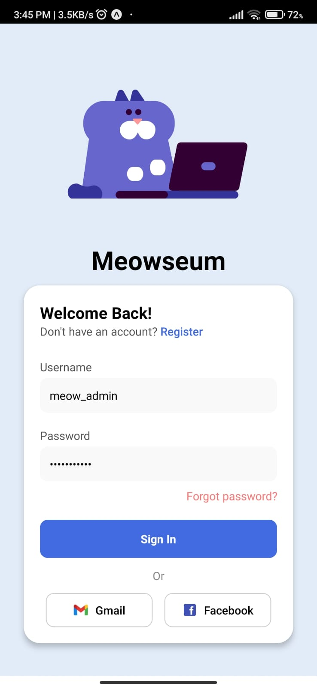
</p>
<p align="center"><i>Splash Screen | Sign Up Screen | Login Screen</i></p>

### 🔹 Cat Exploration
<p align="center">
  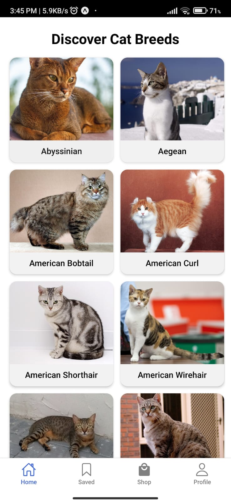
  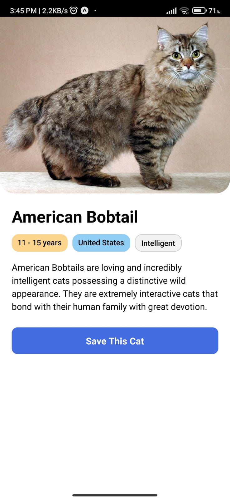
  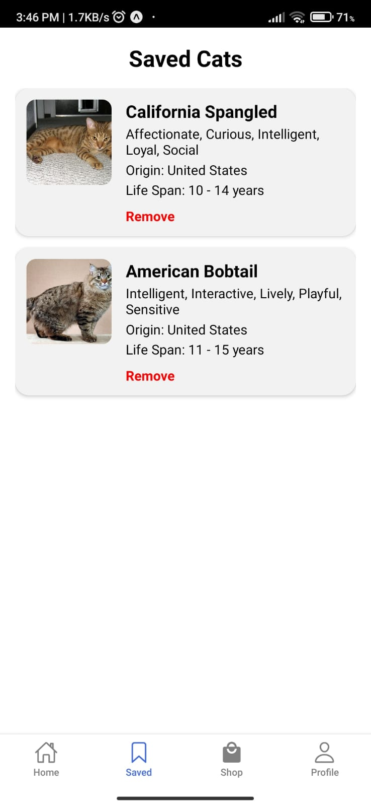
</p>
<p align="center"><i>Home Screen | Cat Details | Saved Cats</i></p>

### 🔹 User Profile
<p align="center">
  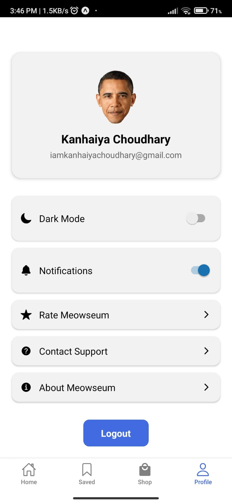
</p>
<p align="center"><i>Profile Screen with dark mode toggle</i></p>

### 🔹 Product Browsing & Purchase
<p align="center">
  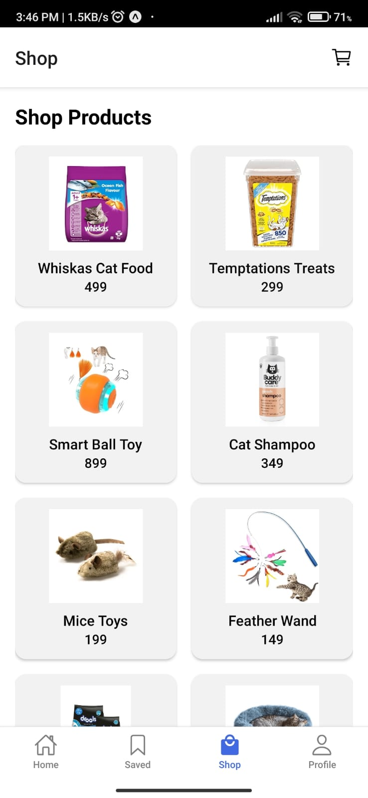
  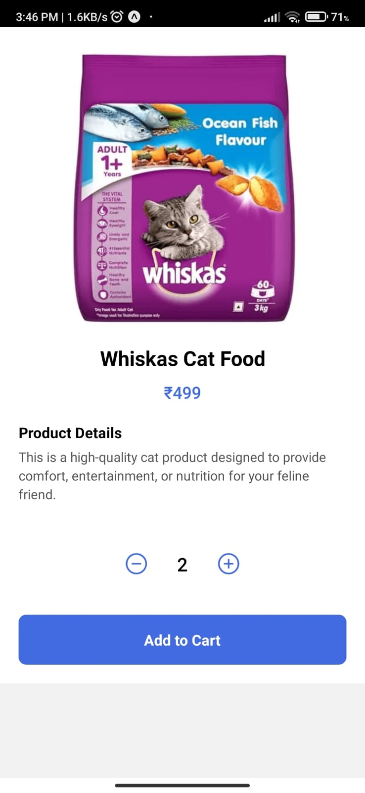
  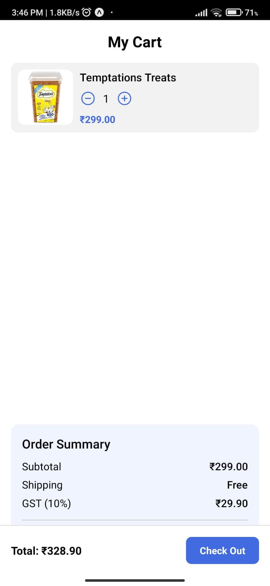
</p>
<p align="center"><i>Product List | Product Details | Cart Screen</i></p>

### 🔹 Checkout Flow
<p align="center">
  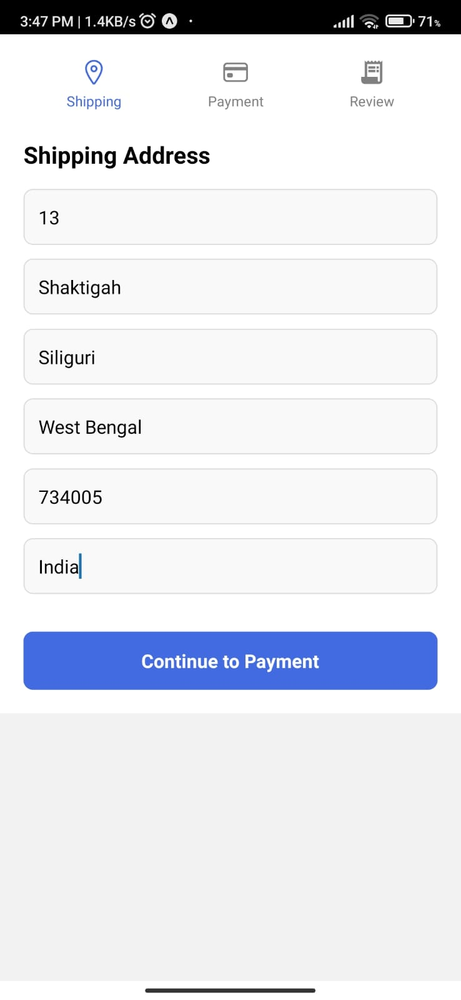
  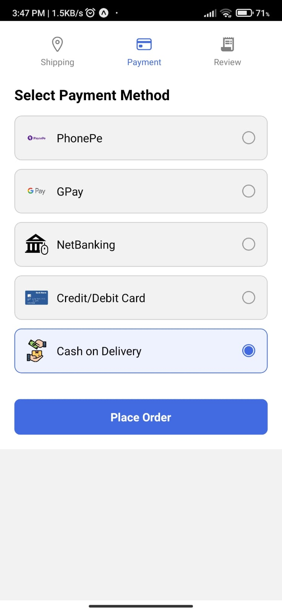
  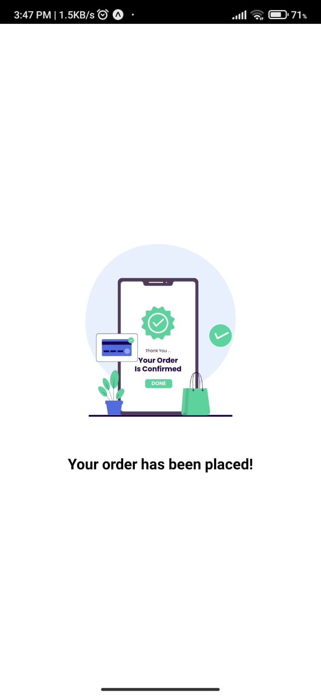
</p>
<p align="center"><i>Shipping Address | Payment Screen | Order Confirmation</i></p>

---

## 🚀 Getting Started

1. Clone the repo  
2. Run `npm install` or `yarn install`  
3. Start the project:

```bash
npx expo start
